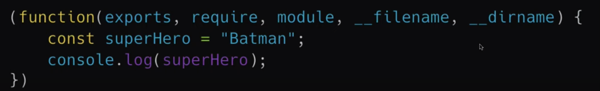

# Introduction

Node.js is the ECMAscript runtime environment for the web.

Chrome uses an engine called V8 that has been written in C++ that executes ECMAscript code.

We can integrate V8 in a C++ application and build further Javascript/ECMAscript functionalities of things found in Cpp but not in ES.

File handling was supported in Cpp but not in js, so Node makes Js implement file handling

Nodejs uses the V8 engine

## Browser vs Node

Node does not have the document features like document, Web API, Cookies like Browser.

With Nodejs you can control the environment

With Nodejs you can do extra functionalities like file handling

Javascript with Node is different from Javascript in Browser.

### The following is how IIFE looks like

It has 5 parameters, exports, require, module, __filename, __diname

So when you import using require, these 5 parameters are exposed
check out [ES6/runmodule.js](ES6/runmodule.js)

### Module Caching

Check out [ES6/CallModuleCache.js](ES6/CallModuleCache.js)

The module that is re-imported to another variable will not exist as a separate instance. The reference will persist especially if it is a class. This is why classes are great for storing states.

### How to export modules (example)

check out [ES6/add.js](ES6/add.js)

