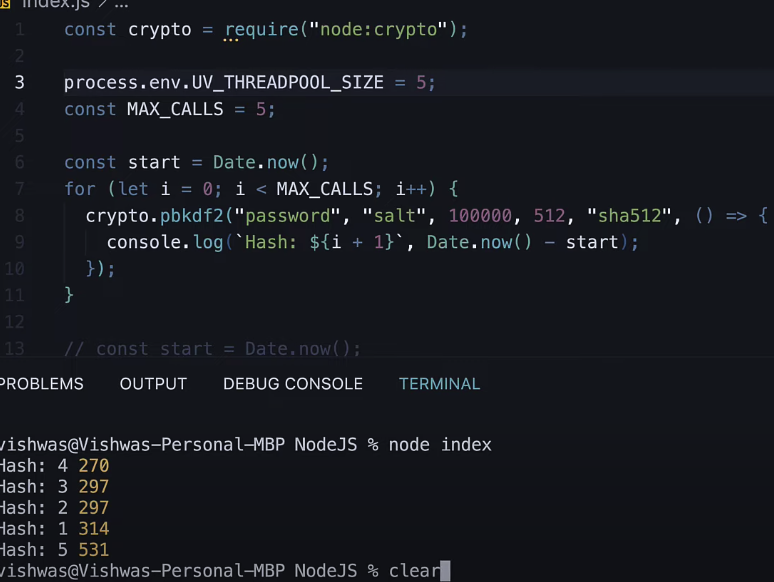
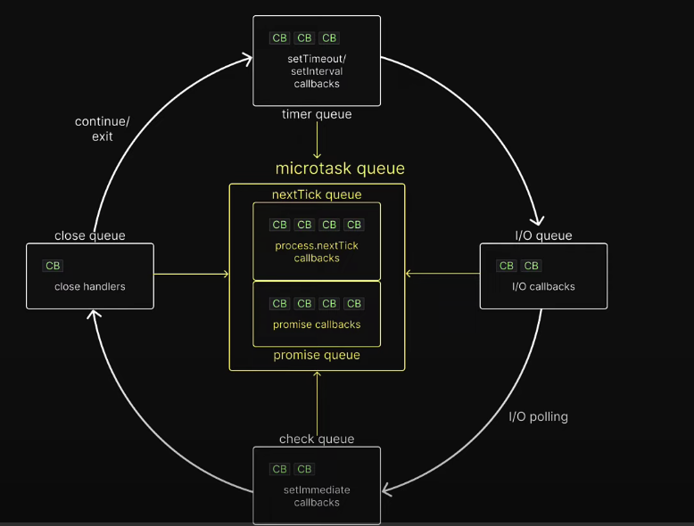

### Thread Pools

Thread pools in node are from libuv. Libuv has a pool of threads so node offloads heavy tasks like reading files to libuv. Libuv uses its threads to execute the heavy tasks by interleaving them with threads while Node itself runs the other tasks.

Node on its own is single threaded so thats why any threading related task is given to libuv.

Note: Libuv's thread pool has 4 threads.

However we can change the number of threads by changing process.env.UV_THREADPOOL_SIZE.

By increasing number of threads, we can increase the performance of our program.

Ensure that the threads in the threadpool do not exceed the number of threads in the CPU core as that will also cause the program to slow.

### Event loops

check out [Event loops video](https://www.youtube.com/watch?v=L18RHG2DwwA&list=PLC3y8-rFHvwh8shCMHFA5kWxD9PaPwxaY&index=42)

Note: Synchronous callbacks take priority over async ones.

This is how async code is executed. Only microtask queue is not part of libuv. Rest everything is part of libuv.

The execution order is as follows:

#### This means that when you use nextTick and Promise for example even if Promise is called first, the nextTick will run before it due to the way the execution order is configured.

In some cases the order of some of the queues cant be guranteed. For example: `setImmediate` and `setTimeout` with time 0 is non deterministic and we cant know which will execute first.