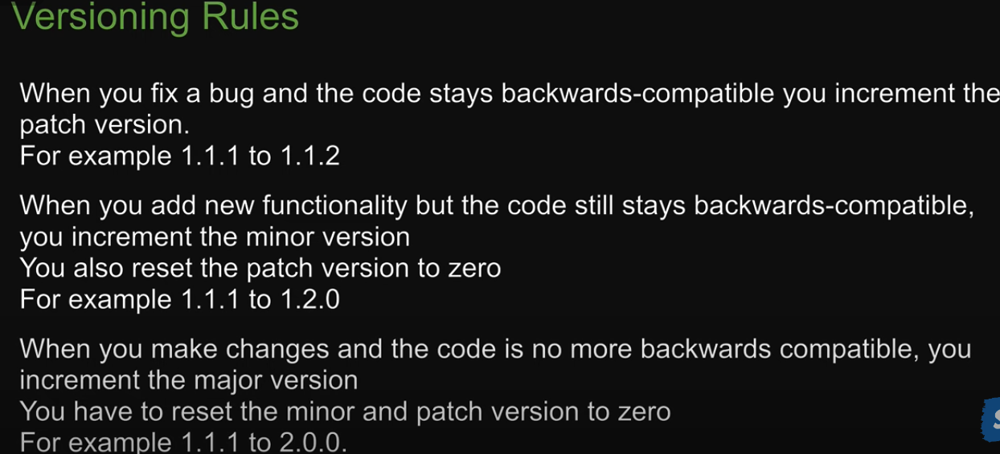
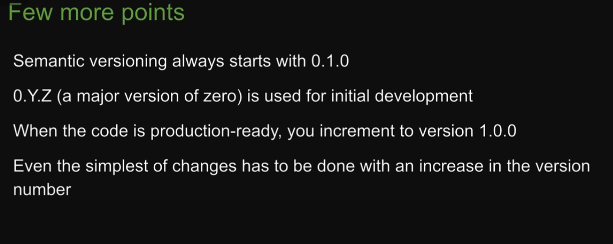
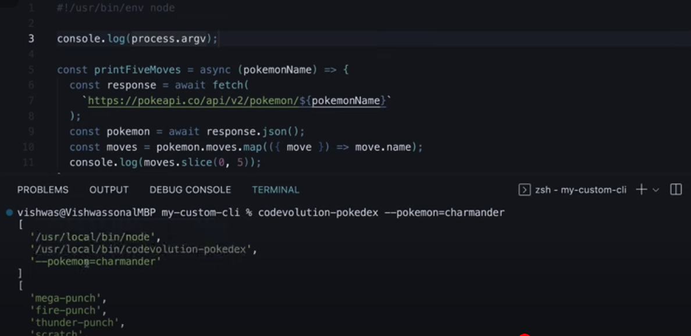
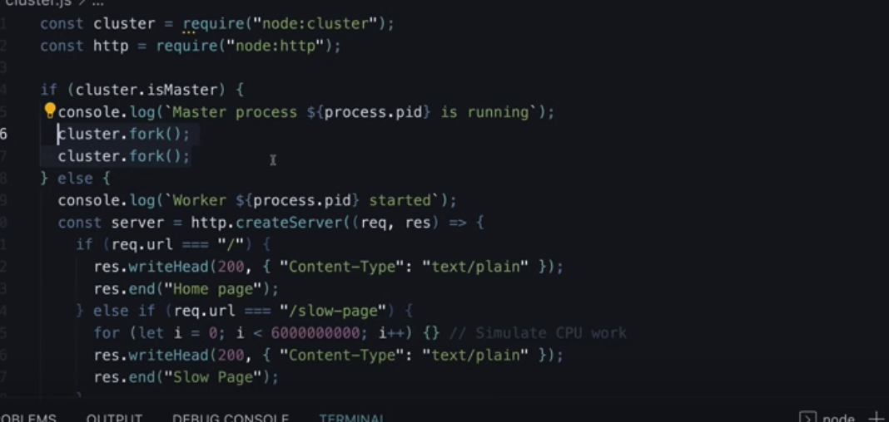

### NPM

npm is the worlds largest software registry.

You have to actively submit a package to the registry.

`npm init` is used to initialise the package.json.

In `keywords`, are words that can be used in the npm registry to look for the particular package. They are indexed by the registry on:

https://www.npmjs.com/ 

A typical `package.json`
```json
{
    "name": "filename",
    "version": "1.0.0",
    "description": "Codevolution greeting package",
    "keywords": [
        "codevolution",
        "greet"
    ],
    "main":"index.js"
}
```

You can also use `npm init --yes` to make the `package.json` with defaults values.

To install an npm package run 

```terminal
$ npm install package-to-install
```

To uninstall an npm package run 

```terminal
$ npm uninstall package-to-install
```

### Versioning and Rules

How versioning works.






### Nodemon and Global packages

Nodemon is an important npm package that is used to restart the application if a change is detected similar to --watch

#### <div> Global packages like nodemon are not listed in the dependencies and must be installed by everyone individually themselves.</div>


### NPM scripts

In package.json in scripts you can write a command

```json
  "scripts": {
    "test": "echo \"Error: no test specified\" && exit 1",
    "start": "node index.js",
    "another": "node index.js"
  },
```

`start` is  a key word so you can just run 

```terminal
$ npm start
```

For other keywords you have to write 

```terminal
$ npm run another
```


### Publishing package

Follow the following video: [Video](https://www.youtube.com/watch?v=IND8P7M3-Ng&list=PLC3y8-rFHvwh8shCMHFA5kWxD9PaPwxaY&index=57) 

Once your package is ready do:

```terminal
$ npm adduser <npm username>
```

```terminal
$ npm publish
```

My sample published package is in [here](npm/greet-check-package/index.js)

And the link in the npm registry is as follows:
https://www.npmjs.com/package/greet-check-package?activeTab=code 


### Making a CLI tool

Have a look at [here](npm/mytool-for-testing/index.js). This is my sample cli tool

First write in your project's `index.js` file

```js
#!/usr/bin/env node
```

In `package.json` add:
```json
  "bin":{
    "mytool-for-testing": "index.js"
  },
```

`index.js` is the entry point for the CLI tool. Whereas the key is what you will run to execute the CLI tool.

Then in your terminal run:
```terminal
$ sudo npm install -g
```

Finall you can run
```terminal
$ mytool-for-testing
```

And your terminal will execute the file.

### Running CLI tool with options

Watch https://www.youtube.com/watch?v=oIg08Z0bqsY&list=PLC3y8-rFHvwh8shCMHFA5kWxD9PaPwxaY&index=59 



`process.argv` contains the command line arguments passed to the Node.js process.

Also do

```terminal
$ npm install yargs
```

to install yargs and you can use the arguments like so

```terminal
$ mytool-for-testing --pokemon=charmanders
```

Those with --var=varvalue will be the arguments and you can pass as many as you like.

```terminal
$ mytool-for-testing --pokemon=charmander --var=varvalue
```

You can use dot notation to retrieve from the dictionary of arguments in your command line tool

### Also watch [this video](https://www.youtube.com/watch?v=sJdqdGxRbXY&list=PLC3y8-rFHvwh8shCMHFA5kWxD9PaPwxaY&index=60) to know how to make the cli more interactive

### Cluster Modules

These manage child processes in parallel. Master-child processes are an alternate to threads however they are more heavy.


